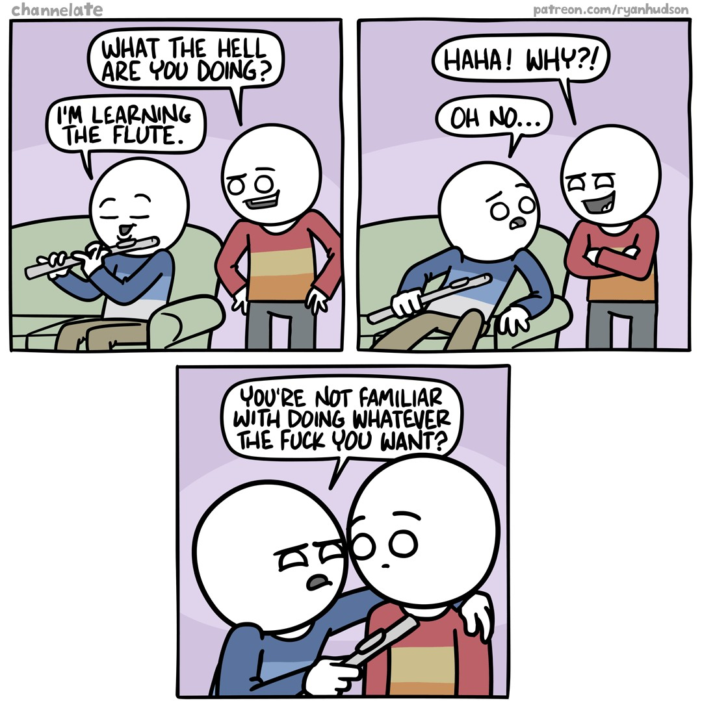

# HTML is a Programming Language!

`html-lang` is experimental and currently in development. Proceed at your own risk!

`html-lang` features no build step, no bundling, no webpack configs. Open up your HTML and start writing HTML.

At only 5kB (gzip) in size, `html-lang` is a tiny framework.

## Why?

Most frameworks are designed to be template engines. These typically mix their template language and JavaScript. Meaning you write and tie together both.

While `html-lang` is similar to quite a bit of existing tech out there, the focus of this library is to bring that programming feel to HTML.

This also allows you to stay inside the framework

And because...



## Install

Include the script tag into the `<head></head>` section of your HTML.

```html
<script src="https://unpkg.com/@joelnet/html-lang@0.0.7/umd/html-lang.js"></script>
```

## Variables

Variables are globally scoped.

```html
<!-- String -->
<val message="Hello World"></val>

<!-- Number -->
<val x:number="888"></val>

<!-- Object -->
<val y:object="{ x: 1, y: 2 }"></val>

<!-- Array -->
<val z:object="['A', 'B', 'C']"></val>
```

## Computed Values

The computed value syntax has a `:?` at the end of the Variable name.

```html
<!-- Set name -->
<val name="World"></val>

<!-- Compute Message -->
<val message:?="'Hello ' + name"></val>
```

## Output

Display a Variable

```html
<!-- set message to "Hello World" -->
<val message="Hello World"></val>

<!-- Display message -->
<span set:text="message"></span>
```

## If / Conditional

```html
<if test="x > 10">X is GREATER than 10!</if>
```

An `else` can be simulated by negating the if condition.

```html
<if test="x > 10">X is GREATER than 10!</if>

<if test="!(x > 10)">X is NOT GREATER than 10!</if>
```

## Loops

A `for-of` loop will loop through all the items in the collection, setting the item to the variable specified.

```html
<!-- Array -->
<val todos:object="['Be Nice to Others', 'Drink Water']"></val>

<!-- todo in todos -->
<for todo:of="todos">
  <div set:text="todo"></div>
</for>
```

A `for-in` loop will loop through all the items in the collection, setting the index to the variable specified.

```html
<!-- Array -->
<val todos:object="['Be Nice to Others', 'Drink Water']"></val>

<!-- set i to 1 -->
<for index:in="todos">
  <div set:text="index"></div>
</for>
```

`for-of` and `for-in` can be combined together if they both point to the same collection.

```html
<!-- Array -->
<val todos:object="['Be Nice to Others', 'Drink Water']"></val>

<!-- set i to 1 -->
<for index:in="todos" todo:of="todos">
  <div><span set:text="index"></span>. <span set:text="todo"></span></div>
</for>
```

## Fetching Data

```html
<!-- fetch data -->
<val response:fetch="'https://swapi.dev/api/people/1'"></val>

<!-- destructure response into loading, error, data -->
<val
  loading:?="response.loading"
  error:?="response.error"
  data:?="response.json"
></val>

<!-- Show when Loading -->
<if test="loading">Loading...</if>

<!-- Show if Error -->
<if test="error"> Error: <span set:text="error"></span> </if>

<!-- Display Data -->
<if test="data">
  <div>name: <span set:text="data.name"></span></div>
  <div>gender: <span set:text="data.gender"></span></div>
  <div>height: <span set:text="data.height"></span>cm</div>
</if>
```

## Examples

### FizzBuzz

```html
<!-- loop through 1 to 100 -->
<for num:of="range(1, 100)">
  <!-- set fizz and buzz Booleans -->
  <val fizz:?="num % 3 === 0" buzz:?="num % 5 === 0"></val>

  <div>
    <!-- Fizz Buzz -->
    <if test="fizz">Fizz</if><if test="buzz">Buzz</if>

    <!-- no match -->
    <if test="!fizz && !buzz">
      <span set:text="num"></span>
    </if>
  </div>
</for>
```

### TODO List

```html
<val todos:object="['Be nice to others', 'Drink water']"></val>

<input type="text" bind:value="newtodo" />
<button on:click:todos="[...todos, newtodo]">add</button>

<hr />

<div watch="todos">
  <for todo:of="todos">
    <div>
      <button on:click:todos="todos.filter((item) => item !== todo)">X</button>
      <span set:text="todo"></span>
    </div>
  </for>
</div>
```
